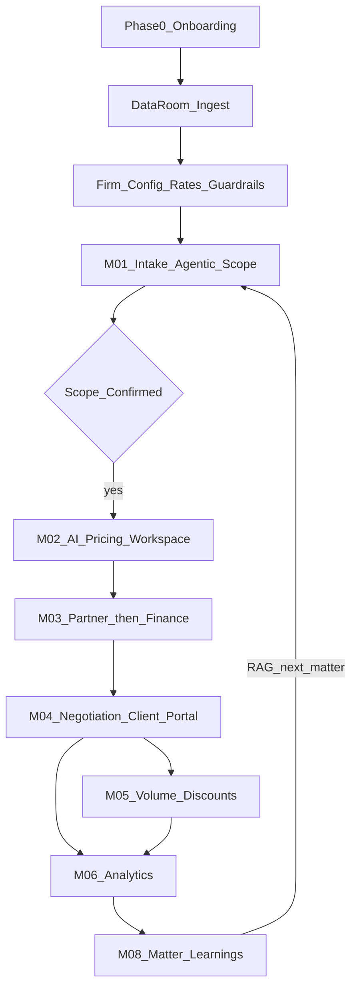
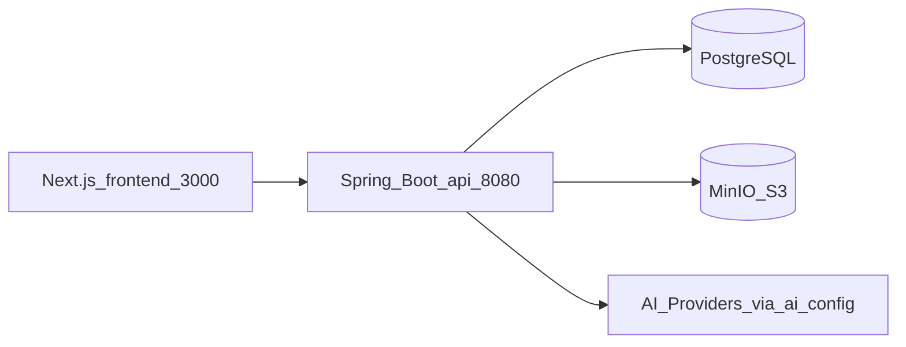

# Lysp — System Overview

Memory-refresh briefing for product + engineering. Not a rewrite of the full tech spec.

**Repos:** frontend `docs/SYSTEM_OVERVIEW.md` · backend `docs/SYSTEM_OVERVIEW.md` (same content)

---

## 1. What Lysp is

Lysp is an **enterprise pricing intelligence platform for elite law firms**.

It ingests historical commercial data (past matters, time entries, bills, rate cards, OCGs, benchmarks) and uses **agentic AI** to help firms scope work, price matters, approve scenarios, negotiate with clients, and learn from closed matters.

| Lysp does | Lysp does not |
|-----------|----------------|
| Data-driven scope and fee recommendations | Generate invoices |
| Human-reviewed, auditable, role-controlled outputs | Self-learn / unsupervised ML |
| Client portal for proposals and negotiation | Replace the firm’s practice systems wholesale |

Think **Harvey for pricing and business development** — an agent that reasons, calls tools, and writes to the database, not a chatbot that only replies in text.

---

## 2. Actors and roles

| Role | Who | Main job in Lysp |
|------|-----|------------------|
| Lysp Admin | Lysp team | Provision firm workspaces, onboarding |
| Firm Admin | Firm ops | Firm settings, users, rate cards, practice areas |
| BDM | Business development | Start pricing requests, run intake / scope |
| CRM | Client-facing | Negotiations, proposals to client |
| Partner | Senior lawyer | Approve pricing scenarios |
| Finance | Financial accountant | Profitability / compliance sign-off |
| Billing | Billing team | Volume discounts, rate cards |
| Pricing Committee | Senior oversight | Large / strategic discounts |
| Auditor | Compliance | Read-only audit trail |
| Client | External | Portal: review proposals, counters, discounts |

---

## 3. End-to-end workflow (happy path)

### Phase 0 — Onboarding (Lysp-managed)

1. Create firm workspace, roles, permissions  
2. Ingest historical data into the **Data Room**  
3. Configure practice areas, fee earners, rate cards  
4. Set guardrails (margin floors, policies)  
5. Configure AI providers (encrypted keys)

### Module 01 — Intake and scope (BDM)

- Conversational intake (chat), not a long form  
- Agent collects practice area, matter, client, narrative, timeline, budget, attachments  
- RAG pulls similar past matters / benchmarks  
- Agent uses **tools** to build phases, tasks, fee-earner mix, assumptions  
- BDM reviews; **nothing advances until scope is confirmed** (`SCOPE_CONFIRMED` locks mutating tools)

### Module 02 — AI pricing workspace

- Multiple fee options from history, rates, guardrails, OCGs  
- Models: fixed, hourly, cap, hybrid, etc.  
- What-if / margin simulation  
- BDM picks a draft scenario → Module 03  

### Module 03 — Approval

- Stage 1: Partner  
- Stage 2: Finance  
- Both required before client-facing send  

### Module 04 — Negotiation + client portal

- CRM sends proposal  
- Client responds in portal (accept / counter)  
- Trail is attributable (not inbox theater)  

### Module 05 — Volume discounts

- Billing programs, tiers, approvals for large discounts  

### Module 06 — Analytics

- Realization, win rate, leakage, practice rollups  

### Module 08 — Knowledge

- After close, Partner/CRM log learnings  
- Future intake retrieves them via RAG  

---

## 4. Architecture (how the code fits)

| Layer | Stack |
|-------|--------|
| Frontend | Next.js 16, React 19, Tailwind 4, axios, JWT in `localStorage` (firm) |
| Backend | Java 21, Spring Boot 3.3, Maven multi-module, Liquibase, JPA |
| Auth | Custom JWT (firm + portal); method security `@PreAuthorize` |
| DB | PostgreSQL only (`lysp`) |
| Files | MinIO (S3 API) via `filestorage` module |
| AI | Model-agnostic: `ai-config` + `StreamingAiClient` / intake; **no direct provider calls from domain modules** |

**Repos layout (backend modules):** `app` (runnable) wires `commons`, `security`, `user-management`, `firm`, `filestorage`, `data-room`, `intake`, `ai-config`, `ai-engine`, `audit-*`, plus scaffold modules for pricing / approval / negotiation / discount / analytics / knowledge / notifications.

**Frontend surfaces:**

- Marketing: `(landing)/` — paper/ink Quicksand editorial  
- Auth: `/auth` — split cinematic + paper form  
- Firm app: `(app)/` — sidebar + navbar (paper/ink theme)  
- Client portal: `client-portal/` — parallel shell  

API base (local): `NEXT_PUBLIC_API_URL=http://localhost:8080` → paths under `/api/v1/...`.

---

## 5. Agentic AI (how intake thinks)

Four pillars (see Cursor rule `ai-engineering.mdc`):

1. **RAG** — `DataRoomContextService` before pricing/scope calls; never call the model “cold”  
2. **Tool use** — agentic loop: AI ↔ tools ↔ DB (max 10 iterations); SSE to UI  
3. **Context engineering** — fresh scope from DB every turn; last ~20 messages  
4. **Memory** — short-term `intake_messages`; long-term `matter_learnings` (human-written for now)

**Guardrails:** firm isolation on every tool, validate inputs (tool errors not crashes), strip mutating tools when scope confirmed, no raw SQL tools, log all tool calls to `tool_call_logs`.

---

## 6. What is built vs scaffold

### Substantially built

| Area | Notes |
|------|--------|
| Auth / users / roles / permissions | Login, JWT, seeded `admin@lysp.io` / `admin123` |
| Firm | Practice areas, fee earners, rate cards, clients, portal users, guardrails |
| Demo seed (startup) | Ashworth Meridian LLP world: 8 practice areas, fee ladder, London 2026 rate card, 8 clients, 55+ closed matters + time/billing/benchmarks in Data Room |
| File storage | MinIO upload/download + metadata |
| Data Room | Datasets, documents, async processors, typed records, mapping |
| Intake | Agentic chat, SSE, 13 tools, RAG (past matters + time + market + learnings), scope CRUD/confirm, attachments |
| AI config | Encrypted multi-provider configs, activate/test |
| Knowledge | `matter_learnings` long-term memory (Phase 1 human-logged, RAG-wired) + articles scaffold |
| Audit trail | `@Auditable` + query UI |

### Frontend built against those APIs

Marketing site, auth, firm shell, pricing-request intake UI, clients, settings (firm / data room / users / roles / AI config), audit page.

### Scaffold / thin (docs may say “complete”; domain model is not)

| Module | Reality today |
|--------|----------------|
| Pricing workspace | Generic CRUD — not full scenario modelling |
| Approval workflow | Scaffold |
| Negotiation | Scaffold (portal auth exists; full negotiation UX incomplete) |
| Discounts | Scaffold |
| Analytics | Scaffold |
| Knowledge | Articles UI thin; learnings table + intake RAG done (no Partner logging UI yet) |
| Notifications | CRUD store — no real email dispatch |
| Nav stubs | Approvals, Negotiations, Analytics, Knowledge routes often missing or empty |
| Pricing page | `/pricing-requests/[uid]/pricing` still “coming soon” |

---

## 7. Local + infra (current)

| Piece | Where |
|-------|--------|
| Frontend | `localhost:3000` |
| Backend | `localhost:8080/api` (Swagger: `/api/swagger-ui.html`) |
| Postgres + MinIO | Remote host `207.180.234.151` (`:5432`, `:9000`, console `:9001`) |
| Compose on server | `/opt/lysp-infra` (Docker) |
| Local secrets | Backend gitignored `.env` / `application-local.yml` |
| Seeded admin | `admin@lysp.io` / `admin123` |
| Demo firm | **Ashworth Meridian LLP** (`firm_lysp`) — practice areas, London 2026 rate card, guardrails, 8 clients, data-room history (auto on backend start) |

Start backend: `start-server.cmd` or `mvnw spring-boot:run -pl app` from `lysp-backend`.  
Start frontend: `npm run dev` from `lysp-frontend`.

---

## 8. Design system

| Surface | Look |
|---------|------|
| Landing + auth | Quicksand; paper `#fefefc`; ink `#0a0a0a`; dark band `#0a0f0d`; black pill CTAs |
| Firm app + client portal | Same paper/ink system (primary token = ink; no brand green); **light/dark toggle** in navbar (persisted as `lysp-platform-theme`) |
| Status | Errors stay rose/red; success is charcoal/ink wash, not emerald |

Marketing archive may still contain old green mockups — ignore for product UI.

---

## 9. Where to read more

| Doc | Location |
|-----|----------|
| Master workflow / actors | `lysp-backend/context/user_story.md` |
| Full technical spec | `lysp-backend/context/LYSP_FULL_TECHNICAL_SPEC.md` |
| Backend conventions | `lysp-backend/architecture.md` |
| Feature bridge docs | `lysp-backend/.lysp-docs/features/*.md` |
| Data Room build notes | `lysp-backend/LYSP_BUILD_DATA_ROOM_BACKEND.md` |
| AI engineering rules | `.cursor/rules/ai-engineering.mdc` (backend) · `lysp-backend-ai-engineering.mdc` (frontend workspace) |
| Backend agent workflow | `lysp-backend/AGENTS.md` |

---

*Lysp System Overview — refresh briefing for returning contributors*
